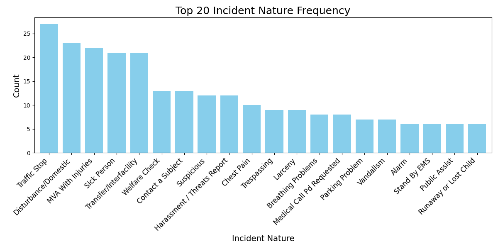
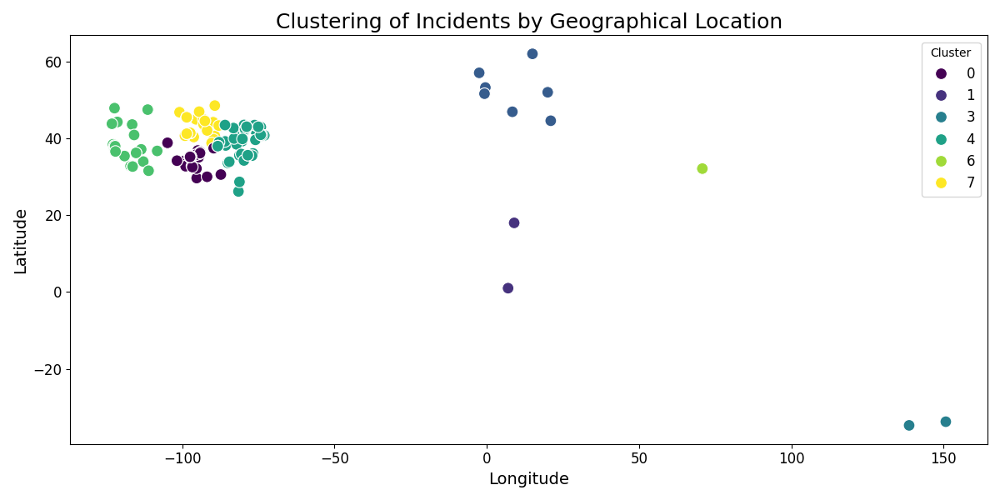
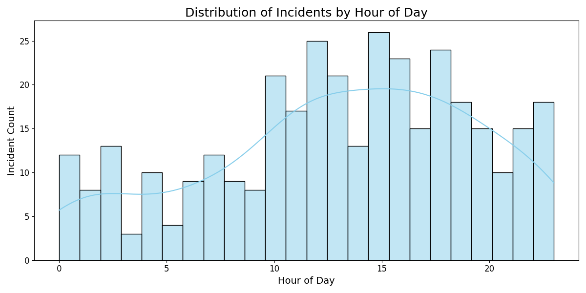

# cis6930fa24-project3

# README

# Name: Sai Sri Harsha Guddati
## Assignment Description
This project involves downloading, extracting, and processing incident data from a PDF available online. The incident data is extracted and processed, and stored in an SQLite database. Additionally, the assignment involves Visualizing the extracted using three types of data visualizations namely bar chart, clustering and histogram.

1. Uploading or Fetching PDFs: Users can either upload PDF files directly via the UI or provide URLs to fetch PDFs containing incident summaries.
2. Extracting Incidents: Key information such as date, incident number, location, nature of the incident, and ORI is extracted from the PDF files.
3. Database Creation: An SQLite database is created to store the extracted incident data.
4. Data Insertion: The extracted incidents are stored in the SQLite database.
5. Data Visualization: Three types of visualizations are generated:
   1. Bar Chart for incident nature frequency.
   2. Clustering of incidents by location.
   3. Histogram for incidents by hour.
6. Testing: Unit tests verify the functionality of file uploads, data extraction, database operations, and visualizations.

## How to Install
To install the required dependencies, ensure you have pipenv installed. Navigate to the project directory and run:

```bash 
pipenv install -e .
```
This will install all the necessary dependencies in an isolated environment.

## How to Run
Fetching and Storing Incidents
You can run the project by following commands:
### Remember to be in project3 folder before running

```bash 
cd project3
pipenv run python app.py
```
Here is an example video of running the code using a valid URL.


This will download the PDF, extract the data, create a local SQLite database, and display the incident nature statistics.

## Testing
To run the test files in the /tests/ folder

```bash
pipenv run python -m pytest -v
```

The test files are located in the tests/ folder, ensuring that the critical functions work as expected.

## Example Output
After running the code with an incident PDF, the following visulaizations are created:









## Functions Overview

### app.py and func.py
#### Application Setup
The code uses the Flask framework to create a web application.
The database file is stored at the path resources/normanpd.db.
#### Routes Overview

1. Homepage (/)

Displays a homepage (index.html) where users can upload files or input URLs for processing.

2. Upload and Process Data (/upload)

Accepts PDF files or URLs provided by the user.

For each file or URL:

The PDF is read and incident data is extracted using the extractincidents() function.

A SQLite database is created (if it doesn't already exist) using createdb().

The extracted data is added to the database using populatedb().

After processing, the user is redirected to the visualization page.

3. Generate Visualizations (/visualize)

Generates visualizations based on the incident data stored in the database.

Visualizations include:

Bar Chart: Frequency of different incident types.

Clustering Plot: Incidents grouped by location.

Histogram: Incident occurrences each hour is shown.

These visualizations are saved as static images and displayed on the visualizations.html page.

#### Supporting Functions
##### extractincidents(io.BytesIO): Extracts incident data from uploaded PDF files.
##### createdb(DB_PATH): Creates a SQLite database if it doesn’t exist.
##### populatedb(DB_PATH, data): Populates the database with the extracted data.
##### fetchincidents(url): Downloads incident reports from given URLs.
##### create_visualizations(DB_PATH): Generates and saves visualizations based on the incident data.

### func.py and app.py These files contains all the code necessary for executing the pipeline. It contains the following functions,

#### extractincidents(pdf_file): Extracts the incidents from the downloaded PDF file.
```python
def extractincidents(pdf_file):
    return "Extracted Incidents"
```
#### createdb(db): Creates an SQLite database with a table for storing incidents.
```python
def createdb(db):
    return "Creates DB named normanpd"
```
#### populatedb(db, incidents): Inserts the extracted incidents into the database.
```python
def populatedb(db, incidents):
    return "Populates the DB with respective fields from extracted data"
```
#### status(db): Displays statistics of incidents, grouped by their nature, to the console.
```python
def create_visualizations(DB_PATH):
    return "Creates visualizations based on the incident data."
```
## Test Files
### test_download.py This file tests the fetchincidents() function by mocking a PDF file download using the requests module.

#### test_fetchincidents(): Ensures that the function fetches and returns the correct content type (BytesIO) for a valid URL.
```python
def test_fetchincidents():
    pass
```
#### test_extractincidents(): Verifies that the incident extraction logic works correctly, parsing the relevant data fields.
```python
def test_extractincidents():
    pass
```
### test_random.py This file contains tests for verifying database operations:

### test_createdb(): Ensures the SQLite database and incidents table are created properly.
```python
def test_createdb():
    pass
```
### test_populatedb(): Confirms that the incident data is correctly inserted into the database.
```python
def test_populatedb():
    pass
```
### test_status(self): Checks the output is being printed correct
```python
def test_status(self):
    pass
```
## Database Development
1. Created a Database named "normandb".
2. Created a Table named "incidents" in the DB.
3. If table exixts, delete the table and then create a new table named the same.
4. The incidents table consists of 5 columns named 
    incident_time TEXT,
    incident_number TEXT,
    incident_location TEXT,
    nature TEXT and
    incident_ori TEXT
5. Values are inserted using executemany() option in SQLite.
6. Respective columns are fetched along with their frequencies in the last step.

### Schema for the table can be created as given below:
```python
import sqlite3
conn = sqlite3.connect(db)
cur = conn.cursor()
cur.execute('''DROP TABLE IF EXISTS incidents''')
cur.execute('''
    CREATE TABLE incidents (
    incident_time TEXT,
    incident_number TEXT,
    incident_location TEXT,
    nature TEXT,
    incident_ori TEXT
    );''')

conn.commit()
conn.close()
```
## User Interface (UI)
1. The index.html and visualization.html files serve as the user interface (UI) components of the Flask web application, providing users with an intuitive way to upload and visualize incident data. Both files are located in the templates folder, which is the default directory for HTML templates in Flask applications. Here's a breakdown of each file's purpose and functionality:

### index.html
This file is the homepage of the application, providing users with a form to upload incident data files or URLs for processing.

Key Features:
#### Header:

Displays the title: "Upload NormanPD Incident PDFs."

Welcomes users with a clear and professional design.

#### File Upload Form:

Allows users to upload multiple PDF files by selecting them from their device.

Uses the input field with the type="file" attribute and multiple option to enable multi-file uploads.

#### URL Submission Form:

Provides a textarea where users can paste multiple URLs (one per line) for downloading and processing incident data PDFs.

#### Submit Button:

A prominent button for submitting the uploaded files and URLs to the /upload route of the Flask application.

Ensures smooth user interaction with hover effects and animations.

#### Responsive Design:

Optimized for different screen sizes, ensuring usability on mobile devices, tablets, and desktops.

Uses modern styles, like gradients and box shadows, for a visually appealing layout.

#### User Feedback:

Validation ensures users either upload files or provide URLs, preventing accidental empty submissions.

### visualization.html

This file displays the visualizations generated from the processed incident data, providing insights into the data through interactive charts and graphs.

Key Features:

#### Header:

Displays the title: "Incident Visualizations."

Provides a clean and informative introduction to the visualization page.

#### Chart Display:

Contains a flexible layout (chart-container) to display three types of visualizations:

Bar Chart: Frequency of different incident types.

Clustering: Grouping incidents based on their locations.

Histogram: Distribution of incidents by the hour.

The img tags use placeholders like {{ bar_chart }}, which are dynamically replaced by Flask with the file paths of generated images.

#### Responsive Design:

Adjusts layout and sizing for smaller screens, ensuring charts remain readable and visually appealing.

Ensures a consistent experience across devices.

#### Hover Effects:

Adds interactivity by enlarging charts slightly and enhancing their shadows when hovered, making the visuals more engaging.

#### Footer:

A simple copyright footer for branding and professionalism.

#### Dynamic Content:

Utilizes Flask's template syntax (e.g., {{ bar_chart }}) to insert dynamically generated image paths, enabling seamless integration with the backend.


## Bugs and Assumptions

### func.py
1. Error Handling: If the URL provided is invalid or the PDF cannot be downloaded, the script raises an exception. There's no specific error handling for malformed URLs.

2. File Format: The script assumes the PDF file follows the same format as expected for proper incident extraction.

3. Regex: The regex only works for the cases that matches with the list of ORI's and Natures that has been placed inside the regex, otherwise it might not match as expected.

### app.py
1. No validation for file types; non-PDF files might cause crashes during processing.

2. Missing error handling for failed URL downloads (e.g., invalid or unreachable URLs).

3. Uploaded files are well-formed PDFs and URLs point to valid resources.

4. Users will not upload malicious files or URLs.

### visualization.py
1. Visualization functions may fail if input data is empty or incomplete.

2. Clustering assumes valid location data but does not handle missing or invalid coordinates.

3. Input data is preprocessed and consistent (e.g., no missing fields).

4. Required Python libraries (e.g., Matplotlib, Seaborn) are installed and compatible.

### index.html
1. No feedback mechanism to inform users about the success or failure of submissions.

2. File input allows all file types, potentially leading to backend errors.

3. Users will upload valid incident reports and URLs.

4. Users understand the file submission process without additional guidance.

### visualization.html
1. Missing fallback or error message for unavailable visualizations (e.g., placeholder {{ bar_chart }}).

2. Static layout may cause display issues on smaller or high-resolution screens.

3. All charts and visualizations are pre-generated and correctly passed from the backend.

4. Users will interpret the charts without needing additional explanations or legends.